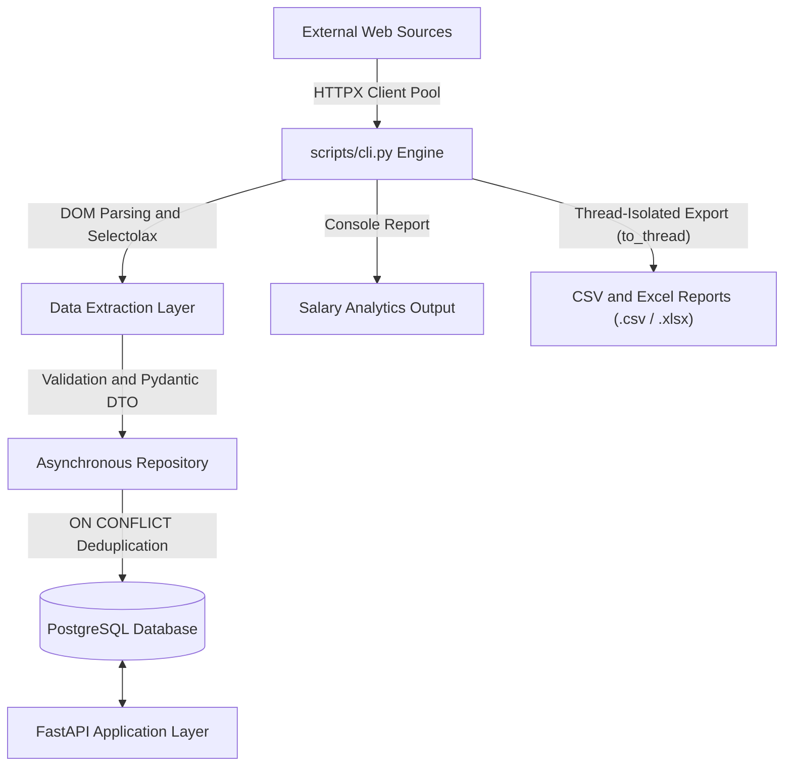

# Architectural Data Flow Diagram

```mermaid
graph TD
    Sources[External Web Sources] -->|HTTPX Client Pool| App["scripts/cli.py Engine"]
    App -->|DOM Parsing and Selectolax| Ext[Data Extraction Layer]
    Ext -->|Validation and Pydantic DTO| Rep[Asynchronous Repository]
    Rep -->|ON CONFLICT Deduplication| DB[(PostgreSQL Database)]
    DB <--> API[FastAPI Application Layer]
    App -->|Console Report| Summary[Salary Analytics Output]
    App -->|"Thread-Isolated Export (to_thread)"| Files["CSV and Excel Reports (.csv / .xlsx)"]
```
